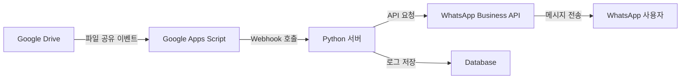

# 📱 Google Drive to WhatsApp 알림 자동화 시스템

## 📋 프로젝트 개요

### 프로젝트명
**GDrive-WhatsApp Notifier** - 구글 드라이브 파일 공유 시 WhatsApp 자동 알림 시스템

### 프로젝트 목적
구글 드라이브에서 파일이나 폴더가 공유될 때 자동으로 WhatsApp 메시지를 통해 관련자들에게 즉시 알림을 전송하는 시스템 구축

### 주요 기능
- 🔔 실시간 구글 드라이브 공유 감지
- 📱 WhatsApp 자동 메시지 전송
- 👥 그룹 및 개인 알림 지원
- 📊 공유 히스토리 및 로그 관리
- 🔧 커스텀 알림 템플릿 지원

## 🏗️ 시스템 아키텍처



## 🛠️ 기술 스택

### Backend
- **Google Apps Script**: 구글 드라이브 이벤트 감지 및 트리거
- **Python 3.10+**: 메인 서버 및 비즈니스 로직
- **FastAPI**: REST API 프레임워크
- **SQLite/PostgreSQL**: 데이터베이스

### Integration
- **Google Drive API**: 파일 공유 이벤트 모니터링
- **WhatsApp Business API**: 메시지 전송
- **Twilio API** (대안): WhatsApp 메시징 서비스

### DevOps
- **Docker**: 컨테이너화
- **GitHub Actions**: CI/CD
- **Ngrok/Cloudflare Tunnel**: 로컬 개발용 터널링

## 📁 프로젝트 구조

```
gdrive-whatsapp-notifier/
│
├── 📂 src/
│   ├── 📄 main.py              # FastAPI 메인 애플리케이션
│   ├── 📄 webhook_handler.py   # 웹훅 처리 로직
│   ├── 📄 whatsapp_client.py   # WhatsApp API 클라이언트
│   ├── 📄 gdrive_monitor.py    # Google Drive 모니터링
│   └── 📄 database.py          # 데이터베이스 모델
│
├── 📂 scripts/
│   ├── 📄 google_apps_script.gs # Google Apps Script 코드
│   ├── 📄 setup.sh              # 환경 설정 스크립트
│   └── 📄 deploy.sh             # 배포 스크립트
│
├── 📂 config/
│   ├── 📄 config.yaml           # 애플리케이션 설정
│   ├── 📄 .env.example          # 환경 변수 예제
│   └── 📄 credentials.json      # Google API 인증 정보
│
├── 📂 docs/
│   ├── 📄 SETUP_GUIDE.md        # 설치 가이드
│   ├── 📄 API_DOCUMENTATION.md  # API 문서
│   └── 📄 TROUBLESHOOTING.md    # 문제 해결 가이드
│
├── 📂 tests/
│   ├── 📄 test_webhook.py       # 웹훅 테스트
│   └── 📄 test_whatsapp.py      # WhatsApp 전송 테스트
│
├── 📄 requirements.txt          # Python 의존성
├── 📄 Dockerfile               # Docker 설정
├── 📄 docker-compose.yml       # Docker Compose 설정
└── 📄 .gitignore              # Git 제외 파일
```

## 🚀 주요 기능 상세

### 1. 구글 드라이브 이벤트 감지
- **실시간 모니터링**: Google Apps Script를 통한 onChange 트리거
- **이벤트 타입 구분**:
  - 새 파일 공유
  - 폴더 공유
  - 권한 변경
  - 공유 해제

### 2. WhatsApp 메시지 전송
- **메시지 타입**:
  - 텍스트 알림
  - 파일 정보 포함
  - 공유 링크 포함
  - 미리보기 이미지 (지원 시)

### 3. 알림 커스터마이징
```yaml
notification_templates:
  file_shared:
    message: "📁 새 파일이 공유되었습니다!\n파일명: {filename}\n공유자: {sharer}\n링크: {link}"
  folder_shared:
    message: "📂 폴더가 공유되었습니다!\n폴더명: {foldername}\n공유자: {sharer}"
```

### 4. 사용자 관리
- **수신자 그룹 설정**
- **알림 우선순위 설정**
- **Do Not Disturb 시간대 설정**

## 💻 개발 환경 설정

### 필수 요구사항
- Python 3.10 이상
- Google Cloud Platform 계정
- WhatsApp Business 계정
- Meta Business 계정

### 빠른 시작 가이드

```bash
# 1. 저장소 클론
git clone https://github.com/yourusername/gdrive-whatsapp-notifier.git
cd gdrive-whatsapp-notifier

# 2. 가상환경 생성 및 활성화
python -m venv venv
source venv/bin/activate  # Windows: venv\Scripts\activate

# 3. 의존성 설치
pip install -r requirements.txt

# 4. 환경 변수 설정
cp config/.env.example config/.env
# .env 파일 편집하여 API 키 입력

# 5. 서버 실행
python src/main.py
```

## 🔐 환경 변수 설정

```env
# Google API
GOOGLE_CLIENT_ID=your_client_id
GOOGLE_CLIENT_SECRET=your_client_secret
GOOGLE_REFRESH_TOKEN=your_refresh_token

# WhatsApp Business API
WHATSAPP_ACCESS_TOKEN=your_access_token
WHATSAPP_PHONE_NUMBER_ID=your_phone_number_id
WHATSAPP_BUSINESS_ACCOUNT_ID=your_business_account_id

# Server Configuration
SERVER_HOST=0.0.0.0
SERVER_PORT=8000
WEBHOOK_URL=https://your-domain.com/webhook

# Database
DATABASE_URL=sqlite:///./gdrive_whatsapp.db
```

## 📊 API 엔드포인트

### 웹훅 수신
```http
POST /webhook/gdrive
Content-Type: application/json

{
  "eventType": "file_shared",
  "fileId": "abc123",
  "fileName": "프로젝트_보고서.pdf",
  "sharedBy": "user@example.com",
  "sharedWith": ["recipient@example.com"],
  "timestamp": "2025-01-15T10:30:00Z"
}
```

### 수동 알림 전송
```http
POST /notify/manual
Content-Type: application/json

{
  "recipients": ["+821012345678"],
  "message": "커스텀 메시지",
  "fileInfo": {
    "name": "문서.pdf",
    "link": "https://drive.google.com/..."
  }
}
```

### 알림 히스토리 조회
```http
GET /notifications/history?limit=50&offset=0
```

## 🧪 테스트

```bash
# 단위 테스트 실행
pytest tests/

# 특정 테스트 실행
pytest tests/test_webhook.py

# 커버리지 리포트
pytest --cov=src tests/
```

## 📈 로드맵

### Phase 1 (MVP) - 2주
- [x] 프로젝트 구조 설정
- [ ] Google Apps Script 기본 구현
- [ ] WhatsApp 메시지 전송 구현
- [ ] 기본 웹훅 서버 구현

### Phase 2 (기능 확장) - 3주
- [ ] 사용자 관리 시스템
- [ ] 알림 템플릿 커스터마이징
- [ ] 대시보드 구현
- [ ] 로그 및 분석 기능

### Phase 3 (최적화) - 2주
- [ ] 성능 최적화
- [ ] 보안 강화
- [ ] 다국어 지원
- [ ] 모바일 앱 연동

## 🤝 기여 가이드

1. Fork the repository
2. Create your feature branch (`git checkout -b feature/AmazingFeature`)
3. Commit your changes (`git commit -m 'Add some AmazingFeature'`)
4. Push to the branch (`git push origin feature/AmazingFeature`)
5. Open a Pull Request

## 📝 라이선스

MIT License - 자유롭게 사용, 수정, 배포 가능

## 👥 팀 구성

- **프로젝트 리드**: [이름]
- **백엔드 개발**: [이름]
- **인프라/DevOps**: [이름]

## 📞 문의 및 지원

- 이슈 트래커: [GitHub Issues](https://github.com/yourusername/gdrive-whatsapp-notifier/issues)
- 이메일: support@example.com
- 문서: [Wiki](https://github.com/yourusername/gdrive-whatsapp-notifier/wiki)

## 🎯 프로젝트 목표 및 KPI

### 성공 지표
- ✅ 공유 이벤트 감지 정확도: 99% 이상
- ✅ 알림 전송 지연 시간: 5초 이내
- ✅ 시스템 가동률: 99.9% 이상
- ✅ 일일 처리 가능 이벤트: 10,000건 이상

### 예상 효과
- 📈 팀 커뮤니케이션 효율 40% 향상
- ⏱️ 파일 공유 인지 시간 90% 단축
- 🔄 워크플로우 자동화로 생산성 증대

---

**Version**: 1.0.0
**Last Updated**: 2025-01-15
**Status**: 🟢 Active Development