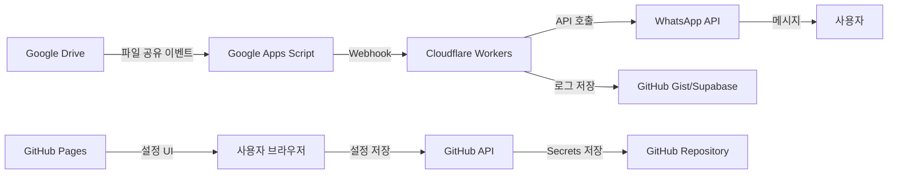

# 🌐 Google Drive to WhatsApp Notifier (GitHub Pages Edition)

## 📋 프로젝트 개요

### 완전 온라인 기반 시스템
서버 없이 GitHub Pages, Google Apps Script, Cloudflare Workers를 활용한 **100% 서버리스** WhatsApp 알림 시스템

### 핵심 특징
- 🚀 **무료 호스팅**: GitHub Pages로 웹 인터페이스 제공
- ⚡ **서버리스**: Cloudflare Workers로 API 처리
- 🔐 **보안**: GitHub Secrets로 API 키 관리
- 🤖 **자동화**: GitHub Actions로 CI/CD
- 📱 **실시간 알림**: WhatsApp Business API 연동

## 🏗️ 시스템 아키텍처 (서버리스)



## 📁 프로젝트 구조 (GitHub Pages)

```
gdrive-whatsapp-notifier/
│
├── 📄 index.html              # 메인 대시보드
├── 📄 config.html             # 설정 페이지
├── 📄 logs.html               # 로그 뷰어
├── 📄 404.html                # 에러 페이지
│
├── 📂 assets/
│   ├── 📄 style.css           # 스타일시트
│   ├── 📄 app.js              # 메인 JavaScript
│   └── 📄 api.js              # API 통신 모듈
│
├── 📂 .github/
│   ├── 📂 workflows/
│   │   ├── 📄 deploy.yml      # GitHub Pages 배포
│   │   └── 📄 sync.yml        # 데이터 동기화
│   └── 📄 FUNDING.yml         # 스폰서 설정
│
├── 📂 workers/
│   ├── 📄 webhook.js          # Cloudflare Worker
│   ├── 📄 wrangler.toml       # Worker 설정
│   └── 📄 package.json        # 의존성
│
├── 📂 scripts/
│   ├── 📄 apps-script.gs      # Google Apps Script
│   ├── 📄 setup.js            # 초기 설정 스크립트
│   └── 📄 deploy.sh           # 배포 스크립트
│
├── 📂 docs/
│   ├── 📄 SETUP.md            # 설치 가이드
│   ├── 📄 API.md              # API 문서
│   └── 📄 FAQ.md              # 자주 묻는 질문
│
├── 📄 _config.yml             # Jekyll 설정
├── 📄 CNAME                   # 커스텀 도메인
└── 📄 README.md               # 프로젝트 문서
```

## 🚀 핵심 구성 요소

### 1. GitHub Pages (프론트엔드)
- **호스팅 URL**: `https://yourusername.github.io/gdrive-whatsapp-notifier`
- **기능**:
  - 실시간 대시보드
  - 설정 관리 UI
  - 로그 모니터링
  - 통계 시각화

### 2. Google Apps Script (이벤트 감지)
- **실행 환경**: Google Cloud
- **트리거**: 시간 기반 (5분마다)
- **기능**:
  - Drive 변경사항 모니터링
  - 웹훅 전송
  - 기본 필터링

### 3. Cloudflare Workers (API 서버)
- **엔드포인트**: `https://gdrive-webhook.your-subdomain.workers.dev`
- **무료 한도**: 일 100,000 요청
- **기능**:
  - 웹훅 수신
  - WhatsApp API 호출
  - 로그 저장
  - Rate limiting

### 4. GitHub Actions (자동화)
- **워크플로우**:
  - 자동 배포
  - 비밀 키 관리
  - 정기 데이터 동기화
  - 테스트 실행

## 💻 구현 상세

### GitHub Pages 웹 인터페이스
```html
<!-- index.html 주요 기능 -->
- 실시간 알림 상태 모니터링
- WhatsApp 수신자 관리
- Google Drive 연동 상태
- 알림 히스토리 조회
- 설정 관리 인터페이스
```

### Cloudflare Workers 스크립트
```javascript
// 주요 기능
- Google Apps Script 웹훅 수신
- WhatsApp Business API 호출
- GitHub Gist/Supabase에 로그 저장
- CORS 처리
- API 키 검증
```

### GitHub Actions 워크플로우
```yaml
# 자동화 작업
- GitHub Pages 자동 배포
- Cloudflare Workers 배포
- 일일 통계 리포트 생성
- 비밀 키 자동 갱신
```

## 🔧 설치 방법 (100% 온라인)

### 1단계: GitHub Repository 생성
```
1. GitHub에서 새 Repository 생성
2. Repository 이름: gdrive-whatsapp-notifier
3. Public으로 설정 (GitHub Pages 무료 사용)
4. Initialize with README 체크
```

### 2단계: GitHub Pages 활성화
```
Settings → Pages → Source: Deploy from a branch
Branch: main / root
커스텀 도메인 설정 (선택사항)
```

### 3단계: Cloudflare Workers 설정
```
1. Cloudflare 계정 생성 (무료)
2. Workers → Create Service
3. Worker 코드 배포
4. 환경 변수 설정
```

### 4단계: Google Apps Script 설치
```
1. Google Apps Script 열기
2. 코드 복사 & 붙여넣기
3. 웹훅 URL 설정 (Cloudflare Worker URL)
4. 트리거 설정 (5분마다)
```

### 5단계: WhatsApp Business 설정
```
1. Meta for Developers 가입
2. WhatsApp Business API 활성화
3. Access Token 발급
4. GitHub Secrets에 저장
```

## 🌟 주요 기능

### 📊 실시간 대시보드
- 최근 공유 파일 목록
- 알림 전송 상태
- 일일/주간/월간 통계
- 에러 모니터링

### ⚙️ 설정 관리
- WhatsApp 수신자 관리
- 알림 규칙 설정
- 필터링 조건
- 알림 템플릿 커스터마이징

### 📝 로그 시스템
- 모든 알림 히스토리
- 성공/실패 상태
- 상세 에러 메시지
- CSV 내보내기

### 🔐 보안 기능
- GitHub Secrets 활용
- API 키 암호화
- CORS 설정
- Rate limiting

## 📱 사용 방법

### 웹 인터페이스 접속
```
https://yourusername.github.io/gdrive-whatsapp-notifier
```

### 초기 설정
1. 설정 페이지 접속
2. Google 계정 연동
3. WhatsApp 번호 등록
4. 알림 규칙 설정

### 모니터링
- 대시보드에서 실시간 상태 확인
- 로그 페이지에서 히스토리 조회
- 통계 페이지에서 사용량 확인

## 🎯 장점

### 비용
- ✅ **완전 무료**: 모든 서비스 무료 티어 사용
- ✅ **서버 불필요**: 유지보수 비용 0원
- ✅ **무제한 사용자**: GitHub Pages 트래픽 제한 없음

### 관리
- ✅ **자동 업데이트**: GitHub Actions로 자동화
- ✅ **버전 관리**: Git으로 모든 변경사항 추적
- ✅ **협업 가능**: Pull Request로 팀 작업

### 확장성
- ✅ **글로벌 CDN**: GitHub Pages CDN 활용
- ✅ **Auto-scaling**: Cloudflare Workers 자동 확장
- ✅ **다국어 지원**: i18n 쉽게 추가 가능

## 📈 제한사항 및 대안

### GitHub Pages
- 한도: 월 100GB 트래픽
- 대안: Vercel, Netlify

### Cloudflare Workers
- 한도: 일 100,000 요청 (무료)
- 대안: Vercel Edge Functions, Netlify Functions

### Google Apps Script
- 한도: 일 실행 시간 6시간
- 대안: Google Cloud Functions

## 🔄 업데이트 및 유지보수

### 자동 업데이트
```yaml
# GitHub Actions로 매일 자정 실행
- 의존성 업데이트
- 보안 패치 적용
- 로그 정리
```

### 수동 업데이트
```bash
# 로컬에서 변경 후
git add .
git commit -m "Update configuration"
git push origin main
# 자동으로 GitHub Pages에 배포됨
```

## 🤝 기여 방법

1. Fork the repository
2. Create feature branch
3. Commit changes
4. Push to branch
5. Open Pull Request

## 📞 지원

- **문서**: GitHub Wiki
- **이슈**: GitHub Issues
- **토론**: GitHub Discussions
- **이메일**: support@example.com

## 📜 라이선스

MIT License - 자유롭게 사용, 수정, 배포 가능

---

**Version**: 2.0.0 (GitHub Pages Edition)
**Last Updated**: 2025-01-15
**Status**: 🟢 Production Ready